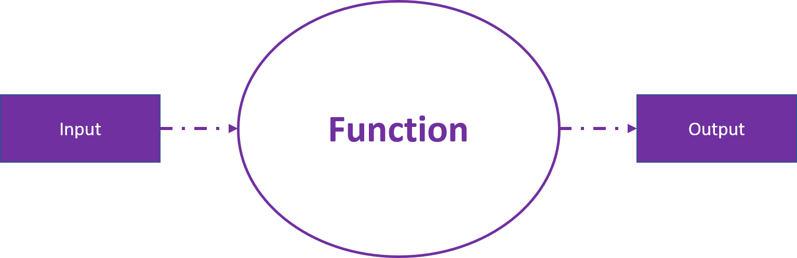
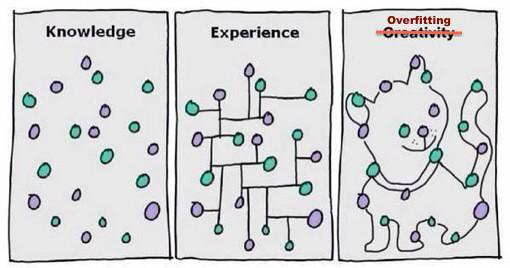

```{r setup, include=FALSE}
options(htmltools.dir.version = FALSE)
library(ggplot2)
library(plotly)
library(dplyr)
livedemosign <- function(top, left, deg) {
  htmltools::div("Live Demo!", class="faa-flash animated",
                 style=glue::glue("border:solid; border-color:black; position:absolute; top:{top}%; left:{left}%; font-size:36px; padding:4px; background-color:white; color:black;transform:rotate({deg}deg);")
                 )
}

```

layout: false
class: bg-main3 split-30 hide-slide-number

.column[

]
.column.slide-in-right[.content.vmiddle[
.sliderbox.shade_main.pad1[
.font5[Welcome]
]
]]

---


# .purple[The basics]


---

class: middle center bg-main1


---

# .purple[What *is* Machine Learning?]

<br>

### Machine learning is concerned with finding functions that best **predict** outputs (responses), given data inputs (predictors).

<br>

<center>

  

</center>

<br>

### Mathematically, Machine Learning problems are simply *optimisation* problems, in which we will use `r icon::fa("r-project", size=1)` to help us solve!

---

# .purple[Why do Machine Learning in `r icon::fa("r-project", size=1)`?]

<br>

<center>

  

</center>

---

# .purple[Supervised vs Unsupervised Learning]

---

layout: false
class: bg-main3 split-30 hide-slide-number

.column[

]
.column.slide-in-right[.content.vmiddle[
.sliderbox.shade_main.pad1[
.font5[Regression]
]
]]

---

# More Elaboration

---

# Regression meme goes here

---

# Shiny app

---

class: split-two white

.column.bg-main1[.content[
# We can fit a linear model in R using the `lm` function as follows:

<br>

```{r, echo=F}
data <- read.csv("data/Income.csv")
```


```{r, eval=F}
fit <-  lm(data=data, #<<
            Income ~ Education)
```
]]
.column.bg-main2[.content.vmiddle.center[
# This tells the `lm` function what data we are referring to
]]

---

class: split-two white

.column.bg-main1[.content[
# We can fit a linear model in R using the `lm` function as follows:

<br>

```{r, eval=F}
fit <-  lm(data=data, 
            Income ~ Education) #<<
```
]]
.column.bg-main2[.content.vmiddle.center[
# This tells the `glm` function what variables we would like to regress. R expects the relationship in the form of `response~predictors`. 
]]

---

class: split-two white

.column.bg-main1[.content[
# We can fit a linear model in R using the `lm` function as follows:


```{r, eval=T}
fit <-  lm(data=data, 
            Income ~ Education)
summary(fit) #<<
```


]]
.column.bg-main2[.content.vmiddle.center[

# Using the `summary` function, we ....
]]

---

---

# Binary outcomes - a case for Logistic Regression

---

# Shiny app

---

# 2 split, glm and predict

---

class: split-two white

.column.bg-main1[.content[
# We can fit a glm in R using the `glm` function as follows:

<br>

```{r, echo=F}
data <- read.csv("data/Spiders.csv")
```


```{r, eval=F}
fit <-  glm(data=data, #<<
            Spiders~GrainSize,
            family=binomial(link="logit")) 
```
]]
.column.bg-main2[.content.vmiddle.center[
# This tells the `glm` function what data we are referring to
]]

---

class: split-two white

.column.bg-main1[.content[
# We can fit a glm in R using the `glm` function as follows:

<br>

```{r, eval=F}
fit <-  glm(data=data, 
            Spiders~GrainSize, #<<
            family=binomial(link="logit")) 
```
]]
.column.bg-main2[.content.vmiddle.center[
# This tells the `glm` function what variables we would like to regress. Just like the `lm` function, R expects the relationship in the form of `response~predictors`. 
]]

---

class: split-two white

.column.bg-main1[.content[
# We can fit a glm in R using the `glm` function as follows:

<br>

```{r, eval=F}
fit <-  glm(data=data, 
            Spiders~GrainSize, 
            family=binomial(link="logit")) #<<
```
]]
.column.bg-main2[.content.vmiddle.center[
## This tells the `glm` function how we would like to model our response. For **binary** response data, we use the `binomial` family. Further, there are many ways we can link our linear combination of predictors to the 0,1 space. Since we are using the **logistic** link, we use `logit` link. Other common links include the `probit` and `cloglog` links.
]]

---
# GLM meme

---

class: middle center bg-main1

`r anicon::faa('exclamation-triangle', animate='flash', size=7)`

# Some considerations when using Logistic Regression!

---

class: middle center bg-main1


---

# Multiple regression

---

# Example 

---

# The Lasso

---

class: middle center bg-main1

## We can think of LASSO regression as only having a certain amount of coefficient size to allocate, forcing some to get none!


<iframe width="800" height="450" src="https://www.youtube.com/embed/08drNP-tZbI?rel=0&amp;showinfo=0&amp;start=10" frameborder="0" allow="autoplay; encrypted-media" allowfullscreen></iframe>


---


layout: false
class: bg-main3 split-30 hide-slide-number

.column[

]
.column.slide-in-right[.content.vmiddle[
.sliderbox.shade_main.pad1[
.font5[Classification]
]
]]

---
# Different data types require different machine learning methods

While we can indeed use Logistic regression to **classify** data points, this simply isn't feasible when

We have high class seperation in our data
We have a non-linear combination of predictors influcing our response


So, what other options do we have?
---

# Decision Trees

---

# Decision Trees in R using `rpart`

---

# A single tree is prone to overfitting

<br>

<center>

  

</center>

<br>


---

# Concept: Bagging


---

# Random Forest


---

# Random Forest in R from `library(RandomForest)`

